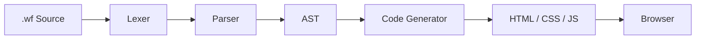

<div align="center">


### ⚡ A modern programming language for building the web


<br/>


<br/>

<a href="https://github.com/Ombryal/WebForge">

</a>

</div>

---

## 🚀 What is WebForge?

WebForge is a small programming language and compiler for building websites from a single `.wf` file.

Instead of manually writing separate HTML, CSS and JavaScript, WebForge aims to provide one language for structure, styling, behaviour, components and more.

```wf
page "Hello World"

heading "Welcome to WebForge"

container {
    text "One file. One language. One website."

    button "Say Hi" {
        on click {
            alert("Hello from WebForge!")
        }
    }
}
```

Compile it:

```bash
./build/webforge examples/hello.wf
```

Into:

```text
hello.wf
   │
   ▼
 WebForge
   │
   ▼
hello.html
```

---

## ✨ Features

### ✅ Current

- Declarative `.wf` syntax
- Lexer → Parser → AST → CodeGen
- HTML generation
- Headings, text, images, links, lists and containers
- Buttons and basic events
- Standalone HTML output
- C++20 + CMake

### 🔮 Planned

- 🎨 CSS & styling
- ⚡ JavaScript generation
- 🧩 Components & reusable layouts
- 🧠 Variables & expressions
- 🔀 Conditionals & loops
- 📱 Responsive layouts
- 🖱️ Interactive states & events
- 🔥 State management
- 🎬 Animations
- 🎞️ Transitions & keyframes
- 📦 Modules & packages
- 🛠️ Formatter & linter
- 💡 Language Server & editor support
- 🔄 Hot reload
- 🌐 Standard library & package ecosystem

---

## 🎬 Future WebForge

The long-term goal is to make styling, animations and interactions first-class language features.

```wf
page "WebForge"

style {
    background "#0b0b12"
    color "#ffffff"

    animation fadeIn {
        duration 500ms
        easing ease_out
    }
}

container class="hero" {
    heading "Forge the Web"

    text "Build modern websites with one language."

    button "Get Started" {
        on click {
            navigate "/docs"
        }
    }
}
```

> [!NOTE]
> The styling and animation syntax above represents the planned direction of WebForge and is not implemented in the current compiler yet.

---

## 🏗️ Architecture



---

## 📁 Project Structure

```text
WebForge/
├── src/webforge/
│   ├── lexer/
│   ├── parser/
│   ├── ast/
│   └── codegen/
├── examples/
├── tests/
├── docs/
├── CMakeLists.txt
├── LICENSE
└── README.md
```

---

## 🛠️ Build

```bash
git clone https://github.com/<your-username>/WebForge.git
cd WebForge

cmake -S . -B build
cmake --build build

./build/webforge examples/hello.wf
```

---

## 🛣️ Roadmap

```text
Lexer + Parser
      ↓
HTML Generation
      ↓
CSS + Styling
      ↓
JavaScript + Events
      ↓
Components + State
      ↓
Animations + Transitions
      ↓
Tooling + IDE Support
      ↓
Packages + WebForge Ecosystem
```

---

## 📖 Documentation

See [`docs/language.md`](docs/language.md) for the current language reference.

---

## 🤝 Contributing

WebForge is still in early development and the language may change significantly.

Issues, ideas and pull requests are welcome.

---

## 📜 License

WebForge is released under the **MIT License**.

See [`LICENSE`](LICENSE).

<div align="center">

<br/>


### ⚡ WebForge

**Forge the web.**

[⭐ Star](https://github.com/<your-username>/WebForge)
&nbsp; • &nbsp;
[🐛 Issues](https://github.com/<your-username>/WebForge/issues)
&nbsp; • &nbsp;
[📖 Docs](docs/language.md)

</div>
